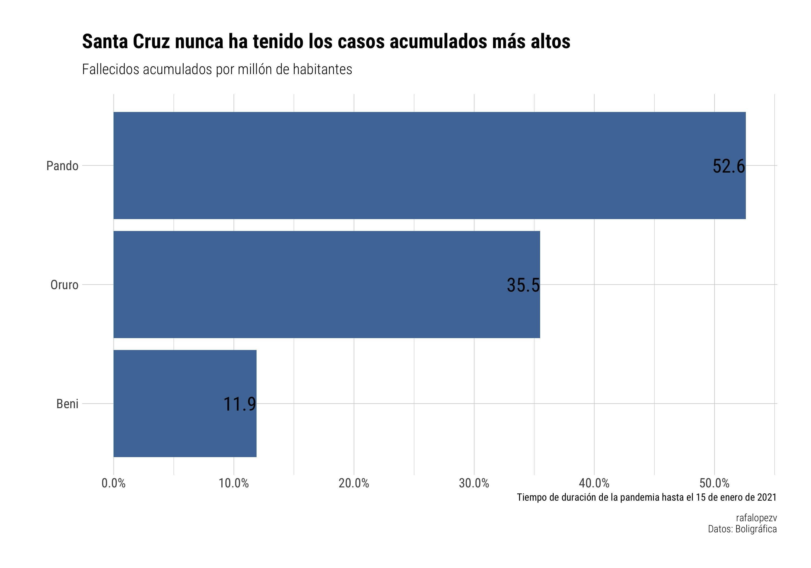

```{r setup, include=FALSE}
knitr::opts_chunk$set(echo = TRUE)
library(tidyverse)
source("code/limpieza.R")
```

<br>

## Lo que dijo Wilfredo Chavez, Procurador general del Estado 

<center></center>

<br>

<center><iframe src="https://www.youtube.com/embed/t-UZXm3aJf8" data-external= "1" width = 70% height = 400 frameborder = 0> </iframe></center>

## Mi respuesta

<center></center>

## Casos acumulados **por millón de habitantes** {.tabset}

### Confirmados

Puede recorrer el botón del tiempo si así lo desea

```{r, warning=F, echo=F}
confirmados_millon_g
```

### Fallecidos

Puede recorrer el botón del tiempo si así lo desea

```{r, warning=F, echo=F}
fallecidos_millon_g
```

## ¿Qué departamento lideró el registro de confirmados por millón de habitantes? {.tabset}

### Confirmados


### Fallecidos



## Letalidad

Ahora, quizás, el indicador más importante 

```{r, warning=F, echo=F}
letalidad_g
```

## ¿Qué departamento ha registrado la más alta letalidad en el tiempo?


## Casos acumulados {.tabset}

### Confirmados

Puede recorrer el botón del tiempo si así lo desea

```{r, warning=F, echo=F}
confirmados_g
```

### Fallecidos

Puede recorrer el botón del tiempo si así lo desea

```{r, warning=F, echo=F}
fallecidos_g
```

## Método

- Fuente de datos sobre casos en Bolivia por departamento: [Boligráfica](https://www.boligrafica.com/) (gracias!)
- Página, gráficos, animaciones: propias vía [R]() y [Observable](https://observablehq.com/@rafalopezv/bar-chart-race)
- Usé el notebook original de [juba](https://observablehq.com/@juba/bar-chart-race) que originalmente viene de [Jhon Murdock](https://observablehq.com/@johnburnmurdoch/bar-chart-race). [A la copia (fork)](https://observablehq.com/@rafalopezv/bar-chart-race) le cambié un par de cosas y lo conecté a [R]() vía la librería [`robservable`](https://juba.github.io/robservable/)
- Los datos de población se descargaron del Instituto Nacional de Estadística. Para los cálculos se utilizó la población proyectada al año 2022.
- Todo es re-utilizable y reproducible
- Si van a compartir, citen


